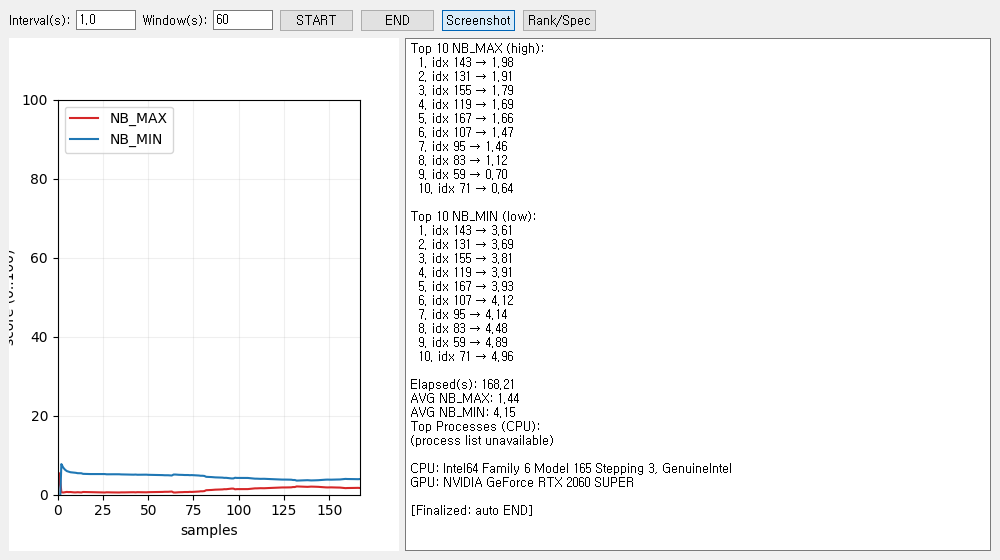

nb-cache-tuner

A lightweight real-time dashboard that visualizes NB_MAX and NB_MIN over a rolling time window using BIT helpers. It samples system activity (CPU by default) and shows time-series curves, rolling-window rankings, and environment specs.

## Features
- Dual Qt backend: prefers PyQt5 and automatically falls back to PySide6
- Embedded Matplotlib for smooth plotting
- Optional psutil for CPU sampling (falls back to a synthetic signal if unavailable)
- Windows-only: Top Processes (CPU) via PowerShell (best-effort, non-blocking)

## Requirements
- Python 3.9+
- One of: PyQt5 OR PySide6
- matplotlib
- Optional: psutil (for CPU sampling), torch (for GPU name)

## Installation
```bash
pip install PyQt5 matplotlib psutil
# or
pip install PySide6 matplotlib psutil
```

## Quick start
```bash
python ui_main.py
```

## Example output
The following image is an example run with sample data.



## How to use (with example data)
1. Set `Interval(s)` and `Window(s)` (e.g., 1.0 / 60).
2. Click `START` to begin sampling.
   - Left: NB_MAX / NB_MIN time series.
   - Right: Top 10 NB_MAX/NB_MIN computed over a rolling window.
3. Click `Rank/Spec` to append CPU/GPU specs and (on Windows) Top Processes (CPU).
4. When both Top 10 lists are filled, the session may auto-finalize (`[Finalized: auto END]`).
5. Click `Screenshot` to copy the current dashboard to the clipboard. Save it as `image.png` in the project root to display it in this README.

## Interpreting the result (based on sample image)
- **Top 10 NB_MAX (high)**: windows ranked by highest peak (e.g., idx 143  1.98). Helps spot spikes.
- **Top 10 NB_MIN (low)**: windows ranked by lowest trough. Helps identify calm/baseline periods.
- **Elapsed(s)**: total measurement time for the session.
- **AVG NB_MAX / AVG NB_MIN**: averages across rolling windows; useful for comparing sessions, hardware, or settings.
- **Top Processes (CPU)**: current heavy CPU users on Windows (best-effort).
- **CPU / GPU**: hardware specs of the environment.

Tip: Comparing the relative level and volatility of NB_MAX vs NB_MIN makes it easy to reason about load patterns (spikes vs steady states).

## Notes
- BIT helpers live in `nb_bit.py` and are imported as `BIT_MAX_NB` / `BIT_MIN_NB`.
- On non-Windows systems, the process list may be unavailable; the app degrades gracefully.

## License
TBD

## Research Background and Sponsorship

I originally built the NB code to read the temporal dynamics of YouTube views. The goal has been clear from day one: adapt extremely quickly to environmental changes while remaining interpretable.

During analysis, I observed a consistent pattern across most datasets: NB_MIN tends to dominate. With GPT‑5 assistance, I inspected down to hardware-level signals, and NB_MIN still prevailed. This raises a counter‑question: what is the underlying cause?

Two possibilities emerge from the data:
1) Our measurement/normalization pipeline might be pressing down the ceiling while thickening the floor.
2) Many real‑world systems might indeed operate with a thicker floor and clipped peaks.

I do not claim certainty on which explanation is more correct yet.

What is certain is that when balance is broken, thresholds, rankings, and resource allocation decisions become unstable. Based on NB observations, I am developing a Balance Recovery Algorithm (BRA) whose purpose is to self‑recalibrate so that the floor becomes thinner and the ceiling regains freedom.

I do not promise a final answer. This code was born for YouTube view analysis and is still finding its direction through observation and experimentation. What I am confident about is the urgency and importance of the problem. That is why I am accepting sponsorships: your support directly funds experimentation, validation, documentation, and open tooling.

- Sponsor the work: https://github.com/sponsors/yoohyunseog
